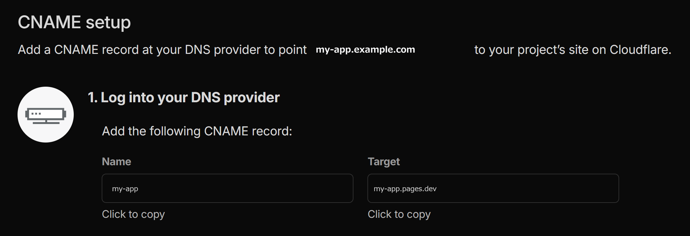
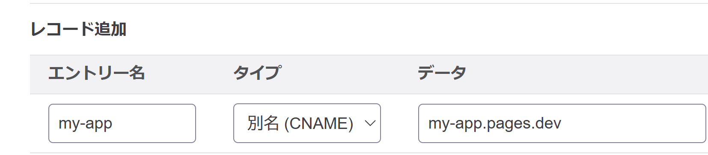

## やったこと

Cloudflare Pagesのカスタムドメインを追加した。（注: スクショ画面ではドメインを用いている）



画面に表示されているName, TargetをコピーしてDNS Setupを完了させよと書いてあったので、DNSプロパイダであるさくらインターネットの設定画面で、そのままペーストした。



## 30分後のdig

Cloudflare側のカスタムドメインのstatusがactiveにならないので不振に思い、WSLターミナルで`dig`コマンドを叩いた（Windowsなら`nslookup`コマンド）。

```
;; ANSWER SECTION:
my-app.example.com.    3387    IN    CNAME    my-app.pages.dev.example.com.
```

`my-app.pages.dev.example.com.`という見覚えのない値が返ってきた。コピペは間違っていない。にもかかわらず、末尾に`.example.com.`が勝手に付いている。何かがおかしい。

## 原因

ターゲット末尾の`.`（ドット）を付け忘れていた。

DNSのゾーンファイルでは、末尾に`.`を持つホスト名は**完全修飾ドメイン名 (FQDN)**として扱われ、`.`を持たないホスト名はゾーン名（この場合は`example.com`）が自動で補完される。

つまり、CNAMEのデータ欄に`my-app.pages.dev`と入力すると、末尾に`.example.com`が補完されて`my-app.pages.dev.example.com.`になる。

[さくらのhelp](https://help.sakura.ad.jp/domain/2712/#index_04-01)にも明記されている。

> ドメインコントロールパネルでは、NSレコードやMXレコード、CNAMEレコードなどのデータ欄にホスト名を入力するタイプについて末尾に「.(ドット)」が必要になります。
> 末尾のドットを入れない場合、ゾーンの名称である独自ドメイン名が自動で補完され、結果として誤った値を指定する事になるので、レコード編集の際には十分ご注意ください。

## 4. 修正

さくらのコントロールパネルで、末尾に`.`を1文字足して、数分ほど待ってから`dig`を叩く。

```
;; ANSWER SECTION:
my-app.example.com.    300    IN    CNAME    my-app.pages.dev.
```

期待通りの値が返ってきた。30分溶かしたが、修正そのものは1文字。AIツールを使っていなかったら半日くらい沼りそうな案件だった。
