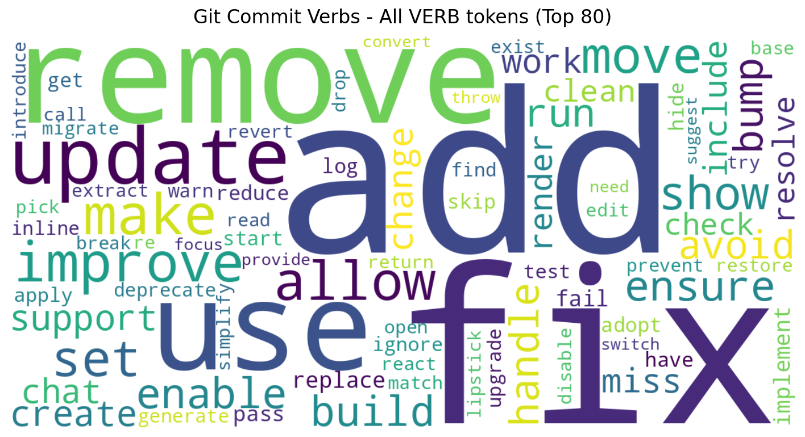

## ハンドピックした85動詞を、実コーパスで検証してみた

英語学習アプリ用に、gitコミットメッセージに出てくる動詞をClaude Opus 4.6の手を借りて自分の主観で選定した。

実際にどれくらい使われているか知りたくて、これを検証してみることにした。
検証する手段はある。OSSのgitログを集計して、リストと突き合わせる。盲点がいくつか出てきたので観察記録としてまとめる。

## 検証対象の85動詞

カテゴリ別に整理したリスト。

| カテゴリ | 動詞 |
| ---------------------------- | ------------------------------------------------------------------------------------------------------------------------ |
| 追加系 (10) | add, create, introduce, implement, set up, integrate, enable, wire up, scaffold, bootstrap |
| 削除系 (6) | remove, delete, drop, clean up, deprecate, strip |
| 修正系 (7) | fix, resolve, correct, patch, address, recover, revert |
| 変更系 (13) | update, modify, change, adjust, tweak, rename, replace, swap, switch, migrate, convert, transform, refactor |
| 構造改善系 (12) | refactor, restructure, reorganize, simplify, consolidate, decouple, extract, inline, hoist, normalize, flatten, abstract |
| パフォーマンス・最適化系 (9) | optimize, speed up, cache, debounce, throttle, lazy-load, batch, parallelize, prefetch |
| 堅牢性・安全性系 (10) | validate, sanitize, escape, guard, harden, restrict, lock, encrypt, redact, fall back to |
| 拡張・強化系 (5) | extend, expose, expand, augment, support |
| リリース・CI/CD系 (5) | bump, release, publish, deploy, automate |
| ドキュメント・テスト系 (8) | document, annotate, describe, cover, mock, stub, assert, verify |

## 検証に用いたソース

検証の対象は、下記7リポジトリのgitログとし、author dateを基準とした5年分のデータ（2021-01-01〜2025-12-31）を用いた。

- [facebook/react](https://github.com/facebook/react)
- [vitejs/vite](https://github.com/vitejs/vite)
- [vercel/next.js](https://github.com/vercel/next.js)
- [angular/angular](https://github.com/angular/angular.git)
- [prisma/prisma](https://github.com/prisma/prisma)
- [tailwindlabs/tailwindcss](https://github.com/tailwindlabs/tailwindcss)
- [microsoft/vscode](https://github.com/microsoft/vscode)

理由は3つ。

1. JavaScript/TypeScriptエコシステムの主要OSSで、コミット文化が比較的揃っている
2. それぞれのリポがConventional Commits系のフォーマットを採用していて、subjectの動詞が抽出しやすい
3. アクティブに開発が継続していて、過去5年分のサンプル数が確保できる

なお、対象7リポジトリのライセンスはMITまたはApache 2.0であり、用途はコミットメッセージの集計（語彙頻度・統計）、生コミットメッセージの再配布はしないこととした。

## 前処理

1. Bot/自動コミットの除外。dependabotやrenovateなどで機械的に生成されたコミットを除外する
2. 非言語的識別子の除外。URLやファイルパス、関数名（getElementID）、Conventional CommitsのPrefixなど

## 英文の解析

Pythonの自然言語処理ライブラリ
[spaCy](https://spacy.io/)を用いて英文の品詞タグ付け・依存構造を解析した。

en_core_web_mdという英語の中サイズモデルを使った。

テキストの文法構造タグが付与され、単語の品詞を判別したり、文の構造から主動詞や単語が名詞か動詞かを判別できる。

- Lemma: 単語の原形。つまりadded/addingならaddが入る
- POS: 品詞。[UPOS](https://universaldependencies.org/u/pos/)にリストされているもの
- Tag: より詳細な品詞情報

## 検証結果

| 順位 | 動詞 | count |
| ---- | ------- | ------ |
| 1 | add | 12,663 |
| 2 | fix | 11,661 |
| 3 | remove | 6,877 |
| 4 | use | 5,550 |
| 5 | update | 4,801 |
| 6 | make | 2,071 |
| 7 | improve | 1,998 |
| 8 | allow | 1,908 |
| 9 | move | 1,688 |
| 10 | set | 1,665 |
| 11 | show | 1,419 |
| 12 | enable | 1,163 |
| 13 | ensure | 1,156 |
| 14 | build | 1,123 |
| 15 | handle | 1,044 |
| 16 | bump | 1,040 |
| 17 | run | 1,011 |
| 18 | avoid | 968 |
| 19 | support | 950 |
| 20 | create | 937 |
| 21 | change | 885 |
| 22 | work | 832 |
| 23 | miss | 825 |
| 24 | chat | 822 |
| 25 | render | 779 |
| 26 | include | 769 |
| 27 | clean | 692 |
| 28 | resolve | 667 |
| 29 | check | 664 |
| 30 | replace | 642 |

## 50件以上出現する動詞を基準にすると7割弱がカバーされている

リスト掲載の基準を50件以上に設定すると、通過するのは85個中59個で、カバー率は69.4%であった。なお句動詞は「spaCyが動詞構造（dep=prtのparticle、またはdep=prepの前置詞）として認識した出現数」で評価している。表層一致は使わず、コーパス上で実際に動詞として扱われた回数のみを基準にした。

| カテゴリ | 件数 | 動詞 |
| -------------------- | ---- | ------------------------------------------------------------------------------------------------------------------------------------------------------------------------------------------------------------------------------------------------------------- |
| ok (50件以上) | 59 | （省略） |
| low_freq (10-50件) | 21 | speed up 49, restrict 49, cover 41, tweak 39, lock 39, suppress 35, describe 31, annotate 27, swap 26, guard 26, reorganize 22, document 21, sanitize 20, scaffold 19, recover 18, debounce 18, throttle 16, automate 16, flatten 14, refactor 13, wire up 10 |
| very_rare (10件未満) | 5 | decouple 6, bootstrap 4, fall back to 4, stub 1, lazy-load 0 |

decouple, bootstrap, stubに加え、句動詞のfall back toとlazy-loadもコミット文脈ではほとんど（または全く）動詞として認識されていなかった。

仮説は以下の通り。

- decouple: コミット粒度では発生しない。設計記事やPR説明には出てくるが、commit subject 1行の単位ではほぼ書かれない
- bootstrap: 動詞よりライブラリ名 (Bootstrap) の固有名詞としてspaCyがPROPN判定しているため動詞集計から漏れる
- stub: mockの方が圧倒的に優勢
- fall back to: spaCyがひとつの句動詞として構造化していない
- lazy-load: ハイフン込み複合語のためspaCyがそもそも動詞として扱っていない

### refactor=13件問題

refactorが13件しかないのは違和感のある数字だ。OSSで全然使われていないわけがない。

理由は単純で、Conventional Commitsのrefactor: プレフィックスを前処理段階で剥がしていたためだった。本文側からは消えている。

prefixベースでrefactorを別カウントすると4,904件であり、prefix由来の動詞はsubject本文には再登場しない傾向があると思われる。

## ハンドピックの盲点

低頻度21個は「リスト側に問題がある語」だが、逆方向の問題もあった。OSSで高頻度なのにリストに無い動詞、つまり取りこぼし。ランキング上位を見て、85リストに無いものを並べる。

| 動詞 | count | 備考 |
| -------- | ----- | ------------------------------ |
| use | 5,550 | 全VERB top4 |
| make | 2,071 | |
| allow | 1,908 | "allow X to Y" 構文教材適性高 |
| show | 1,419 | UI系で頻出 |
| build | 1,123 | |
| run | 1,011 | テスト/CI文脈 |
| avoid | 968 | "avoid X-ing" 学習用例文に最適 |
| include | 769 | |
| check | 664 | |
| skip | 484 | |
| apply | 455 | |
| upgrade | 428 | |
| generate | 420 | |

use, make, allow, avoidといった汎用的な単語が外れていたのは、「初級者が知っているはず」という思い込みのバイアスが見える。コミット文脈でのuse (5,550件) は最頻出動詞のひとつで、これを取りこぼすのはレイヤー設計のミスと言える。

## まとめ

実データで検証して分かったこと。

- それは本当に初心者が学ぶべきbasicな動詞か？━decoupleのような明らかに頻度が低いものは頻出動詞リストに含まれてはならい。
- 汎用的な動詞を見落としていないか？━use, make, allow, avoidを取りこぼしていた。
- 前処理で頻出動詞が消えてしまわないか？━Conventional Commitのprefixを除外する処理を行ったところrefactorの件数が大幅に減少したので注意が必要。

そもそも用いるデータによっても出力結果が変わってくるはずで、今回は自分にとって身近なReact/TypeScriptエコシステムから主要なリポジトリを選んだが、Linux界隈のメーリングリストだとまた変わってくるかもしれない。

もしかしたら動詞によってコミュニティの空気を可視化できるのでは？新規コントリビューターが参入しやすくなるのでは？とふと思った。

## リストをv2にするなら

具体的な修正案。「追加」リストにあるものは取り入れるべきだろう。

- 追加: use, allow, avoid, show
- 追加: make, build, run, include
- 追加: check, skip, apply, upgrade
- 追加: generate
- 追加（句動詞）: comment out, turn on/off; opt in/out, shut down, pick up
- 降格or削除: decouple, bootstrap, stub, lazy-load（実コーパスで動詞として現れない）
- 修正: lazy-load → load、fall back to → fall back（spaCyが動詞構造として認識する書き方へ）

さらに、例文や語義の妥当性、つまり、動詞が文脈の中でどう使われるか？に関しては未検証だし、日本語訳もニュアンスを正しく反映できているかも未検証なので、実用性を高めるにはさらなる検証が必要と思われる。

とはいえ、有料教材レベルのものを作れるわけがないので、オーバーエンジニアリング的なことはしないほうがよさそうだ。自分で使ってみて実際に面白く、身につくかどうかという体験を得ることが次のステップになるかもしれない。
