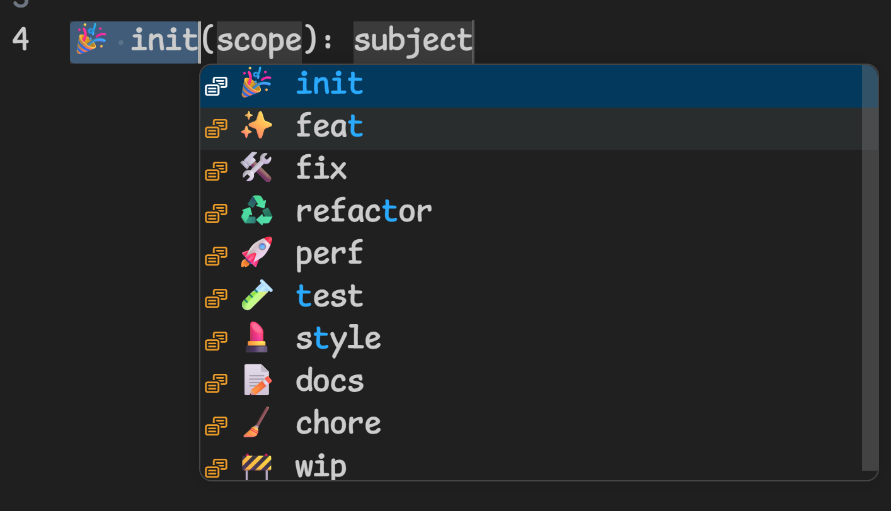

# VS16 (Variation Selector-16) commitlint 対策メモ

OSSプロジェクトでは、コミットメッセージを書くとき`feat:`などのプレフィックスがついていることが多い。視認性をよくするために絵文字をつけることもよく行われる。[gitmoj](https://gitmoji.dev/) など。

そしてコミットメッセージのフォーマットを検証するのに、[commitlint](https://commitlint.js.org/)があり、よくある使い方としては HuskyのPre-Commit フックと併用する。

ここで問題になるのが、typeに絵文字をつけると、同じ絵文字のはずなのにエラーが起きたり通ったりする。

## 原因: VS16 の有無

絵文字には text presentation (モノクロ記号) と emoji presentation (カラー絵文字) の 2 モードがある。一部の絵文字はコードポイント自体に絵文字表示指定がないため、後ろに U+FE0F (VS16) を付けないと text presentation になる。

VS16 が必要な絵文字 (定義側に VS16 を付ける):

- `🛠️` = `U+1F6E0` + `U+FE0F`
- `♻️` = `U+267B` + `U+FE0F`

VS16 付き入力 (`🛠️ fix`) と VS16 なし入力 (`🛠 fix`) は文字列としては別物。`String.startsWith()` や `===` で false になる。

結果、Lintで「絵文字は同じに見えるのに通らない」という謎現象が起きる。

## 解決策：

commitlint公式サイトのサンプルを参考にした。

`@commitlint/config-conventional` の `type-enum` は `===` ベースで動くため、emoji + VS16 を含む値を直接渡すと弾かれるので、カスタムルールを作って、VS16 をトリムしたうえで絵文字を比較するようにする。


```js
// commitlint.config.js

// 🎉 init,✨ feat,🛠️ fix,♻️ refactor,🚀 perf,
// 🧪 test,💄 style,📝 docs,🧹 chore,🚧 wip
const emojiTypes = [
  '\u{1F389} init',
  '\u{2728} feat',
  '\u{1F6E0}\u{FE0F} fix',
  '\u{267B}\u{FE0F} refactor',
  '\u{1F680} perf',
  '\u{1F9EA} test',
  '\u{1F484} style',
  '\u{1F4DD} docs',
  '\u{1F9F9} chore',
  '\u{1F6A7} wip',
];

const plainTypes = emojiTypes.map((t) => t.split(' ')[1]);
// Emojiなしも許容する
const allAllowedTypes = [...emojiTypes, ...plainTypes];

export default {
  extends: ['@commitlint/config-conventional'],
  parserPreset: {
    parserOpts: {
      headerPattern: /^([^(:]+)(?:\(([^)]+)\))?!?: (.*)$/,
      headerCorrespondence: ['type', 'scope', 'subject'],
    },
  },
  plugins: [
    {
      rules: {
        'type-emoji-vs16-enum': (parsed, _when, expectedValues) => {
          const { type } = parsed;
          if (!type) return [false, 'type is required'];

          const normalizedType = type.replace(/\uFE0F/g, '').trim();
          const normalizedExpected = expectedValues.map((v) =>
            v.replace(/\uFE0F/g, '')
          );

          return [normalizedExpected.includes(normalizedType), 'invalid type'];
        },
      },
    },
  ],
  rules: {
    'type-empty': [2, 'never'],
    // 標準ルールは無効化
    'type-enum': [0],
    // Emojiつきで判定する
    'type-emoji-vs16-enum': [2, 'always', allAllowedTypes],
  },
};
```

## VSCode コードスニペット

上記コードではあいまいさをなくすためエスケープ文字列で記述しているが、実際に作成するコミットメッセージは、絵文字をそのまま用いてよい。

すぐに組み合わせを忘れるのでエディタを開くようにして、gitmessageにコピペ用文字列を用意しておく。

VSCodeのスニペットも一応作った。

```json
{
  "Commit Message": {
    "prefix": "commitmsg",
    "body": [
      "${1|🎉 init,✨ feat,🛠️ fix,♻️ refactor,🚀 perf,🧪 test,💄 style,📝 docs,🧹 chore,🚧 wip|}(${2:scope}): ${3:subject}",
    ],
    "description": "Gitmoji + Conventional Commit message",
  },
}
```

リスト形式でtypeを選択することができる。



## 関連

- [Unicode Technical Standard #51: Unicode Emoji](https://www.unicode.org/reports/tr51/)
- [Include Emojis in Commit Messages](https://commitlint.js.org/reference/examples.html#include-emojis-in-commit-messages)